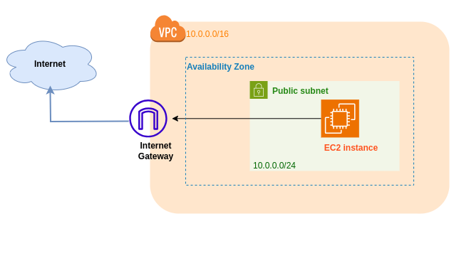
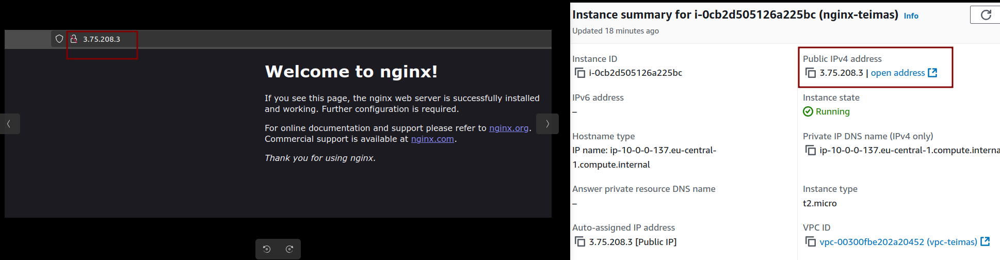

# AWS

## Enumera los pasos que seguirías para desplegar un servidor web básico con nginx sobre una nueva instancia de EC2 en una cuenta de AWS recién creada

Dado que la cuenta de AWS es nueva, deberemos, desde la sesión de la cuenta root, crear un usuario para trabajar desde él (ya   que no es una buena práctica trabajar con la cuenta root). Además, crearemos un grupo al cual le asignaremos los permisos necesarios para realizar las tareas requeridas. A este grupo le asignaremos al usuario, para otorgarle los permisos.

Architectura de la solución:



### Despliegue AWS Console EC2

1. Creacion de **IAM user** y **Roles**
    - Crear un IAM user.
    - No usar el root (Mala practica).
    - Crear Grupo IAM con los roles necesarios para la creacion de la infraestructura, y adjuntar a el usuario al grupo.
2. Creacion de **VPC**
    - Definir el CIDR block (0.0.0.0/16)
    - Configuracion del numero de AZ's, y subnets publicas y/o privadas (+NAT)
3. Creacion de  **Subnet**
     - Crearemos una subnet publica en este caso para proporcionar acceso a internet al servidor, y asociaremos esta a la VPC ya creada, tambien indicaremos su AZ.
4. Creacion de **Internet Gateway**
    - Crearemos una Internet Gateway para conectar nuestra VPC a Internet
5. Cnfigurar la **route table**
    - Crearemos la RT para dirigir el trafico a la IGW.
    - Associaremos la Route Table con la Public Subnet.
6. Creacion de **Security group** para la EC2
    - Security group que  permita inbound traffic a los siguientes puertos:
        - `80`: **HTTP**
        - `443`: **HTTPS**
        - `22`: **SSH**
7. **Launch EC2** instance
    - Desplegarla en la Subnet Publica
    - Seleccionaremos lo siguiente
        - `AMI` (for exampl Ubuntu )
        - `Instance type`(t2.micro free tier)
        - Associaremos a el `Security Group` ya creado 
        - Añadiremos un `Key pair` para acceder mediante SSH a la instancia una vez creada.
        - Usaremos `User Data` para mediante script, automatizar la instalacion y abilitacion de NGINX durante el despliegue:

          ```bash
          #!/bin/bash
            yum update -y
            yum install nginx -y
            systemctl start nginx
            systemctl enable nginx
          ```

8. **Conexion a la instancia EC2** 

    Almacenaremos las claves en (~/.ssh/) y le daremos permisos de Lectura solo al usuario, y ya podremos conectarnos mediante SSh.

    ```bash
      mv /ruta/a/mi-clave.pem ~/.ssh/
      chmod 400 ~/.ssh/mi-clave.pem
      ssh -i "tu-clave.pem" ec2-user@tu-ip-publica
      sudo systemctl status nginx
    ```

9. **Verificar Nginx** en la EC2
    1. Accederemos a la IP publica de la instancia mediante navegador. 
    2. Veremos la Welcome Page que NGINX proporciona por defecto.


